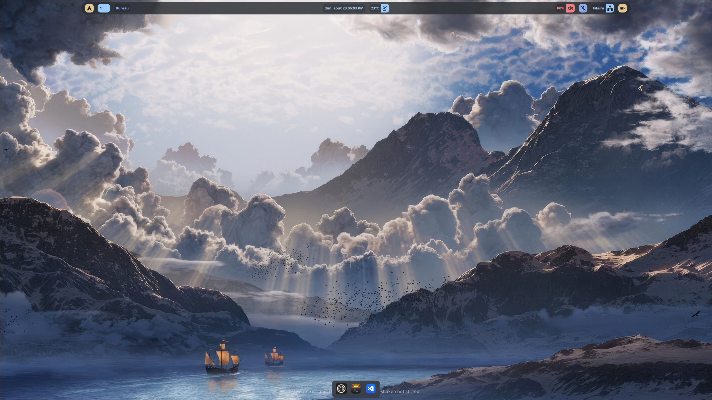
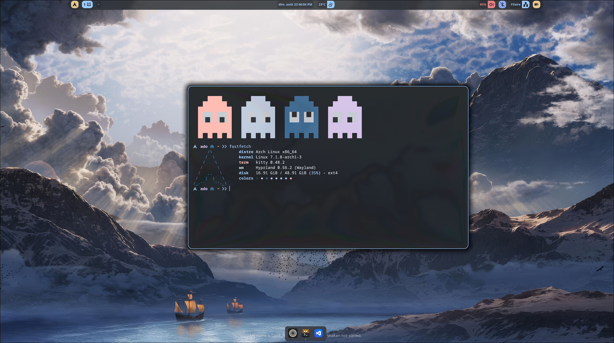
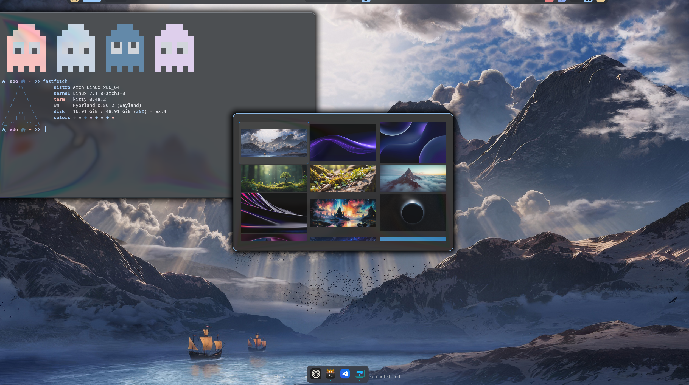
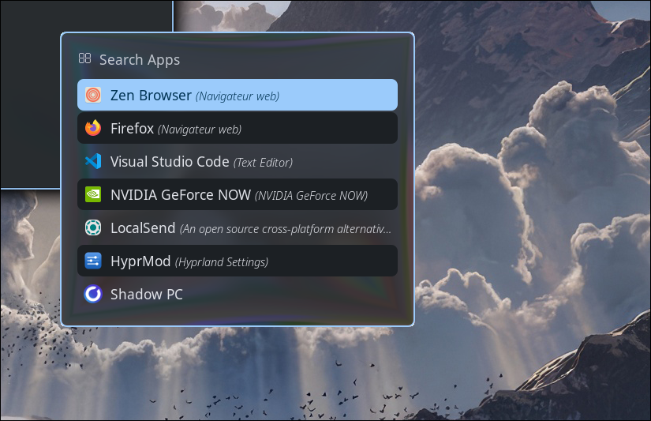

# 🏔️ Hyprland Config

Ma configuration [Hyprland](https://hyprland.org/) sur Arch Linux — pilotée entièrement en **Lua** (via l'API `hl.*` / HyprMod), avec effet verre (hyprglass), couleurs dynamiques générées depuis le fond d'écran (matugen), et une pile d'outils Wayland légère et cohérente.



---

## 📸 Aperçu

| Terminal (kitty + fastfetch) | Sélecteur de fond d'écran (waypaper) | Lanceur d'applications (rofi) |
|:---:|:---:|:---:|
|  |  |  |

---

## 🧰 Stack

| Rôle | Outil | Description |
|---|---|---|
| Compositeur | [Hyprland](https://hyprland.org/) | Compositeur Wayland dynamique (tiling) |
| Config | **Lua** (`hl.*`) | La config n'est pas un `.conf` classique : chaque module (`keybinds.lua`, `appearance.lua`, ...) est un script Lua chargé par `hyprland.lua` |
| Réglages GUI | **HyprMod** | Application graphique de réglages Hyprland, génère `hyprland-gui.lua` |
| Barre | **wayle** (`wayle panel`) | Barre système (horloge, météo, réseau, batterie, volume...) |
| Dock | **hypr-dock** | Dock d'applications |
| Terminal | **kitty** | Terminal GPU, thème assorti au reste du bureau |
| Fetch | **fastfetch** | Résumé système au lancement du terminal |
| Lanceur / switcher | **rofi** (`drun` + `window`) | Lancer une app (`SUPER + D`) ou basculer entre fenêtres (`SUPER + Tab`) |
| Fond d'écran | **hyprpaper** + **waypaper** | `hyprpaper` affiche le wallpaper, `waypaper` sert de sélecteur graphique |
| Couleurs dynamiques | **matugen** | Génère une palette Material You depuis le wallpaper, appliquée aux bordures/ombres/fond |
| Effet verre / blur | **hyprglass** (plugin) | Effet "glass" sur la barre, le dock, rofi et les popups, avec plusieurs presets (`glass`, `clear`, `contrasted`) |
| Captures d'écran | **hyprshot** + **satty** | Capture (écran/zone/fenêtre) et annotation à la volée |
| Verrouillage | **loginctl** | Verrouillage manuel de session |
| Volume / média | **wpctl**, **playerctl**, **brightnessctl** | Contrôle audio (Pipewire/Wireplumber), lecture média, luminosité |
| Navigateur | **Zen Browser** / Firefox | Zen par défaut, Firefox lié à un raccourci |

---

## 🗂️ Structure de la config

```
~/.config/hypr/
├── hyprland.lua        # Point d'entrée, orchestre les require()
├── monitors.lua        # Détection auto des écrans
├── appearance.lua       # Gaps, arrondis, opacité, animations, courbes bézier
├── input.lua            # Clavier AZERTY, touchpad, gestes 3 doigts
├── keybinds.lua         # Tous les raccourcis clavier/souris
├── autostart.lua        # Démarrage : wayle, hyprpaper, hypr-dock, waypaper...
├── rules.lua             # Règles de fenêtres et de layers (float, blur, opacité...)
├── events.lua            # Hooks (notifs au démarrage, opacité par app...)
├── glass.lua             # Config du plugin hyprglass (presets, layers)
├── colors.lua             # Couleurs de base (bordures, ombre, fond)
├── hyprland-gui.lua      # Généré par HyprMod (réglages via l'app graphique)
└── matugen-colors.lua    # Couleurs dynamiques matugen, appliquées en dernier
```

L'ordre de chargement compte : `matugen-colors.lua` est chargé **après** `hyprland-gui.lua` pour que les couleurs générées depuis le wallpaper aient toujours le dernier mot sur les couleurs de bordure.

---

## 📦 Installation

### Réinstallation complète (Arch Linux)

```bash
git clone <url-du-repo> ~/liquid_hyprglass
cd ~/liquid_hyprglass
./install.sh
```

`install.sh` fait tout, de façon idempotente (on peut le relancer sans risque) :

1. Active les dépôts pacman nécessaires (`chaotic-aur`, et le dépôt perso `gh0stzk-dotfiles` pour `colorscript`/l'ascii-art du zsh)
2. Installe `yay`, puis tous les paquets de la stack (Hyprland, wayle, hypr-dock, HyprMod, kitty, zsh + plugins, rofi, waybar, matugen, waypaper, hyprpaper, fastfetch, hyprshot, satty, wf-recorder, playerctl, brightnessctl, pipewire/wireplumber, Firefox, Nautilus, Thunar, mpv, VLC, VS Code, geany, ncmpcpp, polices...)
3. Installe le plugin **hyprglass** via `hyprpm` (repo [hyprnux/hyprglass](https://github.com/hyprnux/hyprglass))
4. Symlink chaque dossier de ce repo vers `~/.config/<outil>/` (et `zsh/.zshrc` → `~/.zshrc`) — toute config déjà présente est sauvegardée en `.bak.<date>` plutôt qu'écrasée
5. Passe le shell par défaut à `zsh` et active `NetworkManager` / `bluetooth`

> ⚠️ La localisation du module météo (`wayle/config.toml`) est un placeholder (`Paris`) — à adapter à ta ville après installation.

Le script suppose une base Arch fonctionnelle (réseau + `sudo` déjà en place, typiquement juste après `archinstall`), et ne gère pas le partitionnement ni les pilotes GPU.

### Structure du repo

Un dossier par outil, dont le contenu correspond à ce qui va dans `~/.config/<outil>/` (sauf `zsh/`, qui contient `.zshrc`, `colorscript` et `asciiart/`, destinés à `~/.zshrc`, `~/.local/bin/` et `~/.local/share/`) :

```
hypr/          → ~/.config/hypr/
hypr-dock/     → ~/.config/hypr-dock/
kitty/         → ~/.config/kitty/
matugen/       → ~/.config/matugen/
rofi/          → ~/.config/rofi/
waybar/        → ~/.config/waybar/
wayle/         → ~/.config/wayle/
waypaper/      → ~/.config/waypaper/
fastfetch/     → ~/.config/fastfetch/
zsh/.zshrc     → ~/.zshrc
```

---

## ⌨️ Raccourcis clavier

> Clavier **AZERTY** — les workspaces sont mappés sur la rangée de chiffres AZERTY (`&`, `é`, `"`, `'`, `(`) pour un clavier 60%.

### Applications

| Raccourci | Action |
|---|---|
| `SUPER + Entrée` | Ouvrir le terminal (kitty) |
| `SUPER + B` | Ouvrir le navigateur (Firefox) |
| `SUPER + E` | Ouvrir le gestionnaire de fichiers (Nautilus) |
| `SUPER + D` | Lanceur d'applications (rofi) |
| `SUPER + W` | Sélecteur de fond d'écran (waypaper) |
| `SUPER + Tab` | Basculer entre les fenêtres ouvertes (rofi) |

### Captures d'écran

| Raccourci | Action |
|---|---|
| `Impr. écran` | Capture de l'écran entier |
| `SUPER + C` | Capture d'une zone sélectionnée |
| `SUPER + Impr. écran` | Capture de la fenêtre active |
| `SHIFT + CTRL + Impr. écran` | Capture d'une zone + annotation directe (satty) |

### Fenêtres

| Raccourci | Action |
|---|---|
| `SUPER + A` | Fermer la fenêtre |
| `SUPER + Espace` | Basculer en mode flottant |
| `SUPER + F` | Plein écran |
| `SUPER + P` | Mode pseudo-tiling |
| `SUPER + ← ↑ → ↓` | Déplacer le focus |
| `SUPER + SHIFT + ← ↑ → ↓` | Déplacer la fenêtre |

### Workspaces

| Raccourci | Action |
|---|---|
| `SUPER + & / é / " / ' / (` | Aller au workspace 1 à 5 |
| `SUPER + SHIFT + & / é / " / ' / (` | Déplacer la fenêtre vers le workspace 1 à 5 |
| `SUPER + molette` | Workspace suivant / précédent |

### Souris

| Raccourci | Action |
|---|---|
| `SUPER + clic gauche` + glisser | Déplacer une fenêtre |
| `SUPER + clic droit` + glisser | Redimensionner une fenêtre |

### Système / verrouillage

| Raccourci | Action |
|---|---|
| `SUPER + L` | Verrouiller la session |
| `SUPER + M` | Quitter Hyprland |

### Touches multimédia

| Touche | Action |
|---|---|
| `Volume +/-` | Ajuster le volume (`wpctl`) |
| `Mute / Mic Mute` | Couper le son / le micro |
| `Luminosité +/-` | Ajuster la luminosité (`brightnessctl`) |
| `Lecture/Pause`, `Suivant`, `Précédent` | Contrôle média (`playerctl`) |

---

## 🎨 Look & feel

- **Layout** : dwindle, avec `preserve_split` activé
- **Gaps** : 5px (intérieur) / 10px (extérieur), bordures de 2px
- **Arrondis** : `rounding = 10`, avec une courbe de puissance personnalisée
- **Opacité** : 90% (fenêtre active) / 82% (inactive) — désactivée pour Zen Browser, réduite pour VS Code
- **Animations** : courbes bézier custom (`easeOutQuint`, `easeInOutCubic`, `quick`, `workspaceSnap`) pour des transitions de fenêtres et de workspaces fluides
- **Effet verre (hyprglass)** : presets `glass`, `clear` et `contrasted` appliqués à la barre, au dock, à rofi et aux popups, avec aberration chromatique et distorsion de lentille sur le preset `glass`
- **Couleurs dynamiques** : la palette (bordures actives/inactives, ombre, fond) est régénérée automatiquement à partir du fond d'écran via matugen

---

## 🔧 Petits détails utiles

- Notification automatique à l'ouverture de Firefox et au démarrage de Hyprland
- Certaines apps (Zen, Firefox, mpv, vlc) restent toujours à 100% d'opacité, même actives
- Geste trackpad 3 doigts horizontal → changer de workspace
- Les fenêtres ne se maximisent jamais automatiquement (règle `suppress-maximize`)
- Fix dédié pour le drag XWayland et les popups Thunar (renommer/copier/déplacer en position centrée)
